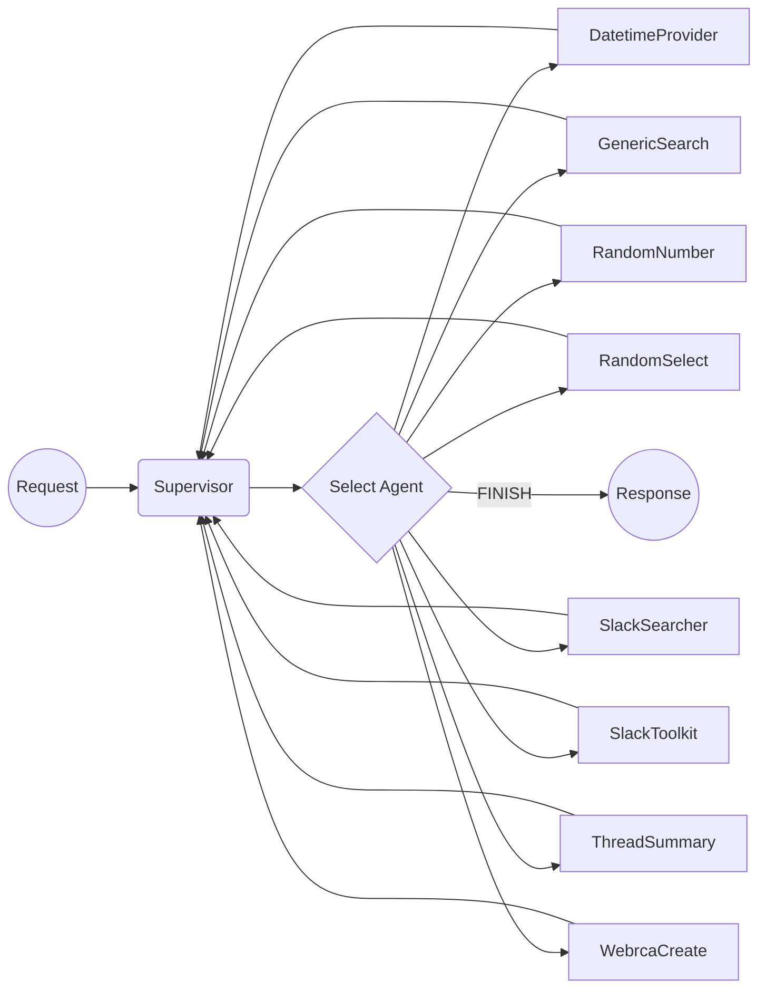

# sre-ascent


## Setup

Ensure having Python 3.11 and poetry installed.

```bash
pip install poetry==1.7.1
```

Install dependencies

```bash
poetry shell
poetry install
```

Copy the `.env.example` file to `.env` and fill in the required environment variables.

```bash
cp .env.example .env
```

## Setup Ollama

Follow instructions in the [Ollama](https://github.com/ollama/ollama)

```bash
ollama serve
ollama pull mistral
```

## Launch LangServe

```bash
langchain serve
```

## Running in Docker

```shell
docker compose up --build
```

## Start Slack socket mode

```shell
slack_socket_mode
```

## Flow Architecture


